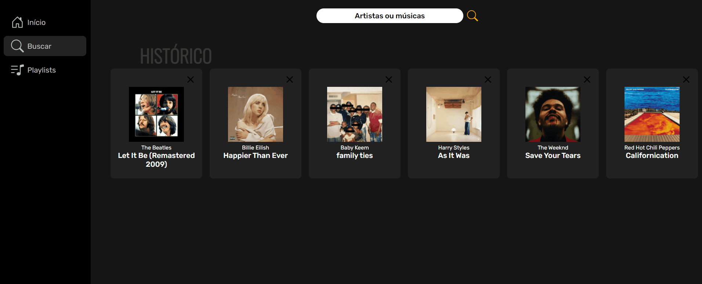
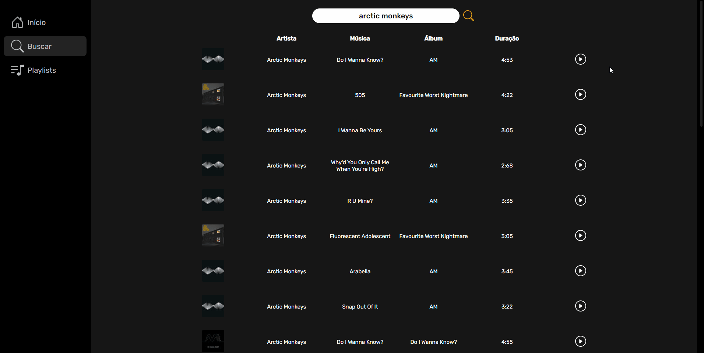
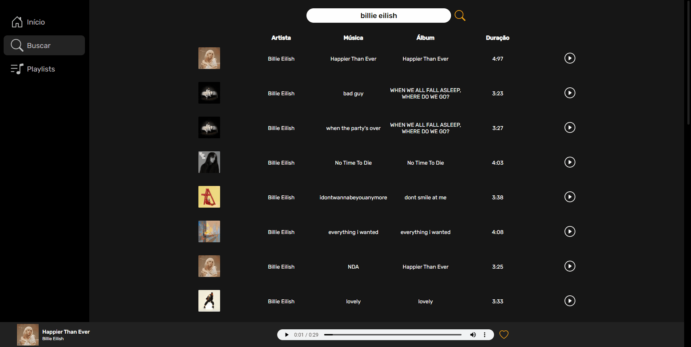

<h1 align="center">LEMONADE.RADIO</h1>

<p align="center">
    
</p>

## Descrição do projeto

LEMONADE.RADIO é um site de streaming de músicas, transmite músicas usando a [API do Deezer](https://rapidapi.com/deezerdevs/api/deezer-1).

É um lugar perfeito para você descobrir músicas novas ou ouvir suas músicas preferidas quantas vezes quiser. Pode ser acessado em todos os tipos de dispositivos, pois o site tem o design responsivo.

Esse projeto foi gerado com [Angular CLI](https://github.com/angular/angular-cli) versão 13.3.0.

##  Fucionalidades do projeto

- Buscar músicas ou artistas:


- Reproduzir as músicas:


- Favoritar suas músicas preferidas:


## Acesso ao projeto

Você pode acessar o projeto [por aqui](https://lemonade-radio.firebaseapp.com) ou baixá-lo.

## Pré-requisitos para baixar o projeto

Para começar a utilizar o projeto é necessário ter o [Node.js](https://nodejs.org/pt-br/) e o [@angular/cli](https://angular.io/) instalados e executar alguns comandos.

### Execute:
```bash
$ npm ci
$ npm run build
```
## Tecnologias

As seguintes ferramentas foram usadas na construção do projeto:

- [TypeScript](https://www.typescriptlang.org/)
- [Angular](https://angular.io/)
- [Node.js](https://nodejs.org/pt-br/)


Feito por GABRIEL BRASIL [Veja meu Linkedin](https://www.linkedin.com/in/gabriel-br/).